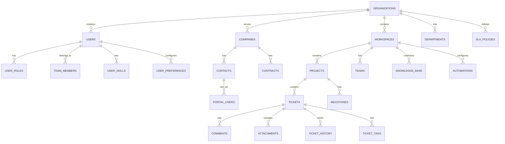

```mermaid
erDiagram
    %% Core Organization Structure
    ORGANIZATIONS ||--o{ USERS : employs
    ORGANIZATIONS ||--o{ WORKSPACES : contains
    ORGANIZATIONS ||--o{ COMPANIES : serves
    ORGANIZATIONS ||--o{ DEPARTMENTS : has

    %% User Management
    USERS ||--o{ USER_ROLES : has
    USERS ||--o{ TEAM_MEMBERS : belongs_to
    USERS ||--o{ USER_SKILLS : has
    USERS ||--o{ USER_PREFERENCES : configures

    %% Customer Management
    COMPANIES ||--o{ CONTACTS : has
    COMPANIES ||--o{ CONTRACTS : has
    CONTACTS ||--o{ PORTAL_USERS : can_be
    
    %% Workspace & Project Structure
    WORKSPACES ||--o{ PROJECTS : contains
    WORKSPACES ||--o{ TEAMS : has
    PROJECTS ||--o{ TICKETS : contains
    PROJECTS ||--o{ MILESTONES : has
    
    %% Ticket Management
    TICKETS ||--o{ COMMENTS : has
    TICKETS ||--o{ ATTACHMENTS : includes
    TICKETS ||--o{ TICKET_HISTORY : tracks
    TICKETS ||--o{ TICKET_TAGS : has
    
    %% Support Features
    WORKSPACES ||--o{ KNOWLEDGE_BASE : maintains
    WORKSPACES ||--o{ AUTOMATIONS : configures
    ORGANIZATIONS ||--o{ SLA_POLICIES : defines
```