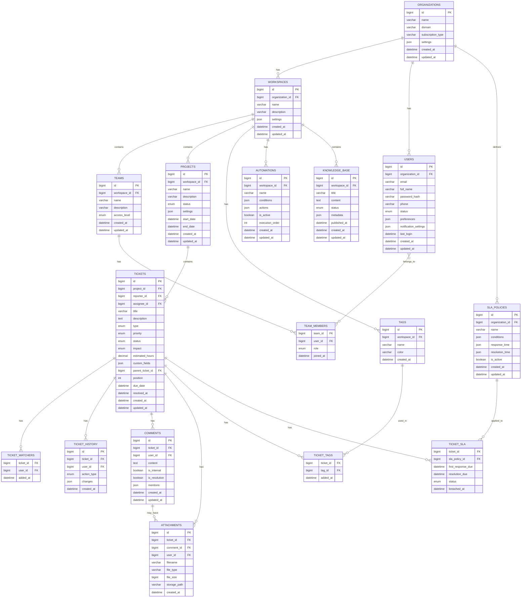

```mermaid
erDiagram
    ORGANIZATIONS {
        bigint id PK
        varchar name
        varchar domain
        varchar subscription_type
        json settings
        datetime created_at
        datetime updated_at
    }

    WORKSPACES {
        bigint id PK
        bigint organization_id FK
        varchar name
        varchar description
        json settings
        datetime created_at
        datetime updated_at
    }

    USERS {
        bigint id PK
        bigint organization_id FK
        varchar email
        varchar full_name
        varchar password_hash
        varchar phone
        enum status
        json preferences
        json notification_settings
        datetime last_login
        datetime created_at
        datetime updated_at
    }

    TEAMS {
        bigint id PK
        bigint workspace_id FK
        varchar name
        varchar description
        enum access_level
        datetime created_at
        datetime updated_at
    }

    TEAM_MEMBERS {
        bigint team_id FK
        bigint user_id FK
        enum role
        datetime joined_at
    }

    PROJECTS {
        bigint id PK
        bigint workspace_id FK
        varchar name
        varchar description
        enum status
        json settings
        datetime start_date
        datetime end_date
        datetime created_at
        datetime updated_at
    }

    TICKETS {
        bigint id PK
        bigint project_id FK
        bigint reporter_id FK
        bigint assignee_id FK
        varchar title
        text description
        enum type
        enum priority
        enum status
        enum impact
        decimal estimated_hours
        json custom_fields
        bigint parent_ticket_id FK
        int position
        datetime due_date
        datetime resolved_at
        datetime created_at
        datetime updated_at
    }

    TICKET_WATCHERS {
        bigint ticket_id FK
        bigint user_id FK
        datetime added_at
    }

    TICKET_HISTORY {
        bigint id PK
        bigint ticket_id FK
        bigint user_id FK
        enum action_type
        json changes
        datetime created_at
    }

    SLA_POLICIES {
        bigint id PK
        bigint organization_id FK
        varchar name
        json conditions
        json response_time
        json resolution_time
        boolean is_active
        datetime created_at
        datetime updated_at
    }

    TICKET_SLA {
        bigint ticket_id FK
        bigint sla_policy_id FK
        datetime first_response_due
        datetime resolution_due
        enum status
        datetime breached_at
    }

    COMMENTS {
        bigint id PK
        bigint ticket_id FK
        bigint user_id FK
        text content
        boolean is_internal
        boolean is_resolution
        json mentions
        datetime created_at
        datetime updated_at
    }

    ATTACHMENTS {
        bigint id PK
        bigint ticket_id FK
        bigint comment_id FK
        bigint user_id FK
        varchar filename
        varchar file_type
        bigint file_size
        varchar storage_path
        datetime created_at
    }

    TAGS {
        bigint id PK
        bigint workspace_id FK
        varchar name
        varchar color
        datetime created_at
    }

    TICKET_TAGS {
        bigint ticket_id FK
        bigint tag_id FK
        datetime added_at
    }

    AUTOMATIONS {
        bigint id PK
        bigint workspace_id FK
        varchar name
        json conditions
        json actions
        boolean is_active
        int execution_order
        datetime created_at
        datetime updated_at
    }

    KNOWLEDGE_BASE {
        bigint id PK
        bigint workspace_id FK
        varchar title
        text content
        enum status
        json metadata
        datetime published_at
        datetime created_at
        datetime updated_at
    }

    ORGANIZATIONS ||--o{ WORKSPACES : has
    ORGANIZATIONS ||--o{ USERS : has
    WORKSPACES ||--o{ TEAMS : contains
    WORKSPACES ||--o{ PROJECTS : contains
    TEAMS ||--o{ TEAM_MEMBERS : has
    USERS }o--o{ TEAM_MEMBERS : belongs_to
    PROJECTS ||--o{ TICKETS : contains
    TICKETS ||--o{ TICKET_WATCHERS : has
    TICKETS ||--o{ TICKET_HISTORY : has
    TICKETS ||--o{ COMMENTS : has
    TICKETS ||--o{ ATTACHMENTS : has
    TICKETS ||--o{ TICKET_TAGS : has
    TICKETS ||--o{ TICKET_SLA : has
    COMMENTS ||--o{ ATTACHMENTS : may_have
    WORKSPACES ||--o{ TAGS : has
    TAGS ||--o{ TICKET_TAGS : used_in
    ORGANIZATIONS ||--o{ SLA_POLICIES : defines
    SLA_POLICIES ||--o{ TICKET_SLA : applied_to
    WORKSPACES ||--o{ AUTOMATIONS : has
    WORKSPACES ||--o{ KNOWLEDGE_BASE : contains

```